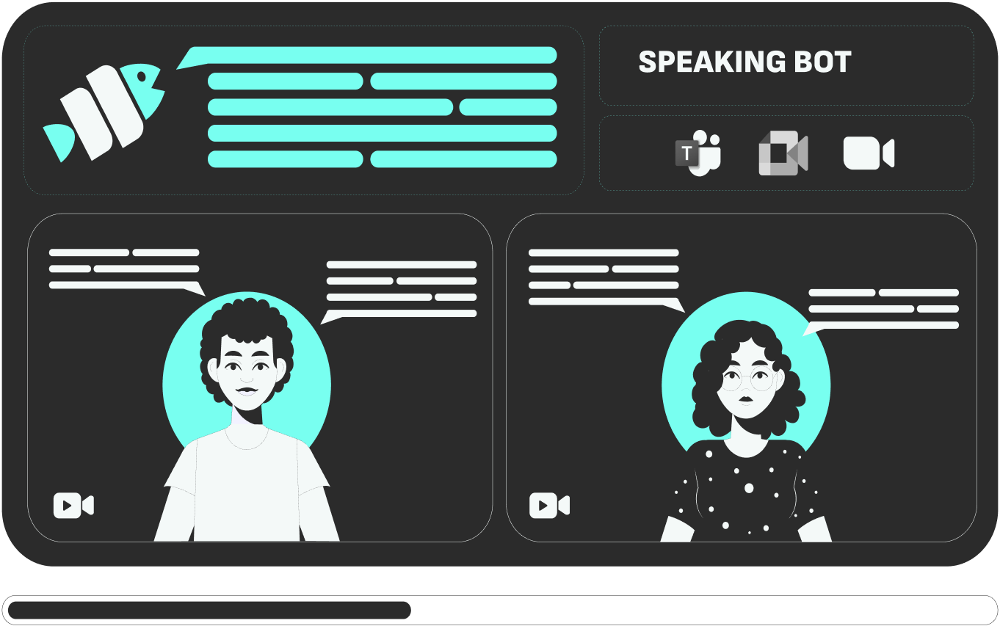

<p align="center"><a href="https://discord.com/invite/dsvFgDTr6c"></a></p>

# Speaking Bot

<p align="center">
  
</p>

This repository expands upon [Pipecat](https://github.com/pipecat-ai/pipecat)'s Python framework for building voice and multimodal conversational agents. Our implementation creates AI meeting agents that can join and participate in Google Meet and Microsoft Teams meetings with distinct personalities and capabilities defined in Markdown files.

## Overview

This project extends [Pipecat's WebSocket server implementation](https://github.com/pipecat-ai/pipecat/tree/main/examples/websocket-server) to create:

- Meeting agents that can join Google Meet or Microsoft Teams through the [MeetingBaas API](https://meetingbaas.com)
- Customizable personas with unique context
- Support for running multiple instances via a simple API
- WebSocket-based communication for real-time interaction

## Architecture

### Core Framework: Pipecat Integration

[Pipecat](https://github.com/pipecat-ai/pipecat) provides the foundational framework with:

- Real-time audio processing pipeline
- WebSocket communication
- Voice activity detection
- Message context management

In this implementation, Pipecat is integrated with [Cartesia](https://www.cartesia.ai/) for speech generation (text-to-speech), [Gladia](https://www.gladia.io/) or [Deepgram](https://deepgram.com/) for speech-to-text conversion, and [OpenAI](https://platform.openai.com/)'s GPT-4 as the underlying LLM.

### API-First Architecture

The project follows a streamlined API-first approach with:

- A lightweight FastAPI server that handles bot management via direct MeetingBaas API calls
- WebSocket server for real-time communication between MeetingBaas and Pipecat
- Properly typed Pydantic models for request/response validation
- Clean separation of concerns with modular components

#### API Endpoints

1. Root endpoint (`GET /`):

   - Health check endpoint
   - Returns: `{"message": "MeetingBaas Bot API is running"}`

2. Run Bots (`POST /run-bots`):

   ```json
   {
     "meeting_url": "https://meet.google.com/xxx-yyyy-zzz",
     "personas": ["interviewer"],
     "meeting_baas_api_key": "your-api-key",
     "bot_image": "https://example.com/avatar.jpg",
     "entry_message": "Hello, I'm here to help!"
   }
   ```

   - Required field: `meeting_url`
   - Authentication: send `x-meeting-baas-api-key` as a request header
   - Optional override: `websocket_url`
   - Returns: MeetingBaas `bot_id`

3. WebSocket endpoint (`/ws/{client_id}`):
   - Real-time communication channel for audio streaming
   - Binary audio data and control messages
4. Pipecat WebSocket endpoint (`/pipecat/{client_id}`):
   - Connection point for Pipecat services
   - Bidirectional conversion between raw audio and Protobuf frames

### WebSocket URL Resolution

The server determines the WebSocket URL to use in the following priority order:

1. User-provided URL in the request (if specified in the `websocket_url` field)
2. `BASE_URL` environment variable (recommended for production)
3. ngrok URL in local development mode
4. Auto-detection from request headers (fallback, not reliable in production)

For production deployments, it's strongly recommended to set the `BASE_URL` environment variable to your server's public domain (e.g., `https://your-server-domain.com`).

### Project Extensions

Building upon Pipecat, we've added:

- Persona system with Markdown-based configuration for:
  - Core personality traits and behaviors
  - Knowledge base and domain expertise
  - Additional contextual information (websites formatted to MD, technical documentation, etc.)
- AI image generation via [Replicate](https://replicate.com/docs)
- Image hosting through [UploadThing](https://uploadthing.com/) (UTFS)
- [MeetingBaas](https://meetingbaas.com) integration for video meeting platform support
- Multi-agent orchestration via API

## Required API Keys

### For Pipecat-related Services

- [OpenAI](https://platform.openai.com/) (LLM)
- [Cartesia](https://www.cartesia.ai/) (text-to-speech)
- [Gladia](https://www.gladia.io/) or [Deepgram](https://deepgram.com/) (speech-to-text)
- [MeetingBaas](https://meetingbaas.com) (video meeting platform integration)

### For Project-specific Add-ons

- [OpenAI](https://platform.openai.com/) (LLM to complete the user prompt and match to a Cartesia Voice ID)
- [Replicate](https://replicate.com/docs) (AI image generation)
- [UploadThing](https://uploadthing.com/) (UTFS) (image hosting)

For speech-related services (TTS/STT) and LLM choice (like Claude, GPT-4, etc), you can freely choose and swap between any of the integrations available in [Pipecat's supported services](https://docs.pipecat.ai/api-reference/services/supported-services).

### Important Note

[OpenAI](https://platform.openai.com/)'s GPT-4, [UploadThing](https://uploadthing.com/) (UTFS), and [Replicate](https://replicate.com/docs) are currently hard-coded specifically for the CLI-based persona generation features: matching personas to available voices from Cartesia, generating AI avatars, and creating initial personality descriptions and knowledge bases.
You do not need a Replicat or UTFS API key to run the project if you're not using the CLI-based persona creation feature and edit Markdowns manually.

## Persona System

### Bot Service

- Real-time audio processing pipeline
- WebSocket-based communication
- Tool integration (weather, time)
- Voice activity detection
- Message context management

- Dynamic persona loading from markdown files
- Customizable personality traits and behaviors
- Support for multiple languages
- Voice characteristic customization
- Image generation for persona avatars
- Metadata management for each persona

### Persona Structure

Each persona is defined in the `@personas` directory with:

- A README.md defining their personality
- Space for additional markdown files to expand knowledge and behaviour

### Example Persona Structure

```
@personas/
└── quantum_physicist/
    ├── README.md
    └── (additional beVhavior files)
```

## Prerequisites

- Python 3.x
- `grpc_tools` for protocol buffer compilation
- Ngrok (for local deployment)
- Poetry for dependency management

## Installation

### 1. Set Up Poetry Environment

```bash
# Install Poetry (Unix/macOS)
curl -sSL https://install.python-poetry.org | python3 -

# Install Poetry (Windows)
(Invoke-WebRequest -Uri https://install.python-poetry.org -UseBasicParsing).Content | py -
```

### 2. Install System Dependencies

The project requires certain system dependencies for scientific libraries:

```bash
# macOS (using Homebrew)
brew install llvm cython

# Ubuntu/Debian
sudo apt-get install llvm python3-dev cython

# Fedora/RHEL
sudo dnf install llvm-devel python3-devel Cython
```

### 3. Set up Project with Poetry

```bash
# Clone the repository (if you haven't already)
git clone https://github.com/yourusername/speaking-meeting-bot.git
cd speaking-meeting-bot

# Configure Poetry to use Python 3.11+
poetry env use python3.11

# Install dependencies with LLVM config path
# On macOS:
LLVM_CONFIG=$(brew --prefix llvm)/bin/llvm-config poetry install

# On Linux (path may vary):
# LLVM_CONFIG=/usr/bin/llvm-config poetry install

# Activate virtual environment
poetry env activate
```

### 4. Compile Protocol Buffers

```bash
poetry run python -m grpc_tools.protoc --proto_path=./protobufs --python_out=./protobufs frames.proto
```

### 5. Configure Environment

```bash
cp env.example .env
```

Edit `.env` with your MeetingBaas credentials and add the runtime settings needed for your environment.

Example `.env` file:

```
MEETING_BAAS_API_KEY=your_api_key_here
BASE_URL=https://your-server-domain.com  # For production
PORT=7014
CORS_ALLOW_ORIGINS=https://your-frontend.example.com
```

## Running Meeting Agents

### API Server Setup

There are two ways to run the server:

```bash
# Standard mode
poetry run api --host 0.0.0.0 --port ${PORT}

# Local development mode with ngrok auto-configuration
poetry run python app/main.py --local-dev
```

The local development mode simplifies WebSocket setup by:

- Automatically detecting ngrok tunnels
- Handling WebSocket URL configuration for MeetingBaas
- Supporting up to 2 bots (limited by free ngrok tunnels)
- Providing clear warnings about limitations

### Setting Up ngrok for Local Development

1. Install ngrok if you haven't already:

   ```bash
   brew install ngrok  # macOS
   ```

2. Sign up for an ngrok account at https://dashboard.ngrok.com/signup and get your authtoken.

3. Configure your ngrok authtoken:

   ```bash
   ngrok config add-authtoken YOUR_AUTHTOKEN_HERE
   ```

4. Start ngrok tunnels for your bot connections:

   ```bash
   # Start ngrok with the provided configuration
   ngrok start --all --config config/ngrok/config.yml
   ```

   This will create two tunnels (ports 7014 and 7015) for running multiple bots.

5. Copy the ngrok HTTPS URL (e.g., `https://xxxx.ngrok-free.app`) and set it as `BASE_URL` in your `.env` file:

   ```bash
   BASE_URL=https://xxxx.ngrok-free.app
   ```

6. Start the server:

   ```bash
   poetry run uvicorn app:app --reload --host 0.0.0.0 --port 7014
   ```

### Creating Bots via API

The WebSocket URL is optional in all cases. The server determines the appropriate URL based on the priority list described in the [WebSocket URL Resolution](#websocket-url-resolution) section:

```bash
curl -X POST http://localhost:${PORT}/bots \
  -H "Content-Type: application/json" \
  -H "x-meeting-baas-api-key: your-api-key" \
  -d '{
    "meeting_url": "https://meet.google.com/xxx-yyyy-zzz",
    "personas": ["interviewer"]
  }'
```

You can still manually specify a WebSocket URL if needed:

```bash
curl -X POST http://localhost:${PORT}/bots \
  -H "Content-Type: application/json" \
  -H "x-meeting-baas-api-key: your-api-key" \
  -d '{
    "meeting_url": "https://meet.google.com/xxx-yyyy-zzz",
    "personas": ["interviewer"],
    "websocket_url": "wss://your-custom-websocket-url.example.com"
  }'
```

### Production Deployment Considerations

When deploying to production, always set the `BASE_URL` environment variable to ensure reliable WebSocket connections:

1. Set `BASE_URL` to your server's public domain:

   ```
   export BASE_URL=https://your-server-domain.com
   ```

2. Ensure your server is accessible on the public internet

3. Consider using HTTPS/WSS for secure connections in production

### Troubleshooting Local Development

If you encounter issues with the local development mode:

1. Make sure ngrok is running with the correct configuration
2. Verify that you've entered the correct ngrok URLs when prompted
3. Check that your ngrok URLs are accessible (try opening in a browser)
4. Remember that the free tier of ngrok limits you to 2 concurrent tunnels

## Future Extensibility

The persona architecture is designed to support:

- Scrapping the websites given by the user to MD for the bot knowledge base
- Containerizing this nicely

## Troubleshooting

- Verify Poetry environment is activated
- Check Ngrok connection status
- Validate environment variables
- Ensure unique Ngrok URLs for multiple agents

For more detailed information about specific personas or deployment options, check the respective documentation in the `@personas` directory.

## Troubleshooting WebSocket Connections

### Handling Timing Issues with ngrok and Meeting Baas Bots

Sometimes, due to WebSocket connection delays through ngrok, the Meeting Baas bots may join the meeting before your local bot connects. If this happens:

- Simply press `Enter` to respawn your bot
- This will reinitiate the connection and allow your bot to join the meeting

This is a normal occurrence and can be easily resolved with a quick bot respawn.

## Running the API Server

### Local Development

```bash
# Install dependencies
poetry install

# Compile Protocol Buffers
poetry run python -m grpc_tools.protoc --proto_path=./protobufs --python_out=./protobufs frames.proto

# Run the API server with hot reload
poetry run uvicorn app:app --reload --host 0.0.0.0 --port ${PORT}
```

### Local Testing with Multiple Bots

For local development and testing with multiple bots, you'll need two terminals:

```bash
# Terminal 1: Start the API server
poetry run uvicorn app:app --reload --host 0.0.0.0 --port ${PORT}

# Terminal 2: Start ngrok to expose your local server
ngrok http ${PORT}
```

Once ngrok is running, it will provide you with a public URL that the server will use for WebSocket connections in local development mode.

### API Improvements

The API has been completely redesigned for simplicity and reliability:

- Direct integration with the MeetingBaas API without subprocess management
- Strongly typed Pydantic models with proper validation
- Cleaner WebSocket handling with better error management
- Improved logging with better visibility into the system
- Enhanced JSON message processing for debugging
- Intelligent WebSocket URL resolution with multiple fallback methods
- Support for explicit BASE_URL configuration for production environments

The direct API integration provides several benefits:

```python
# Direct API call to MeetingBaas
meetingbaas_bot_id = create_meeting_bot(
    meeting_url=request.meeting_url,
    websocket_url=websocket_url,  # Determined by the server via multiple methods
    bot_id=bot_client_id,
    persona_name=persona_name,
    api_key=request.meeting_baas_api_key,
    # Additional parameters
    bot_image=request.bot_image,
    entry_message=request.entry_message,
    extra=request.extra,
)
```

This approach eliminates the complexity of subprocess management, provides immediate feedback on bot creation, and returns both the MeetingBaas bot ID and client ID for WebSocket connections.

### Production Deployment

For production deployment, always set the BASE_URL environment variable:

```bash
# Set the BASE_URL for WebSocket connections
export BASE_URL=https://your-server-domain.com

# Run the API server in production mode
poetry run api --host 0.0.0.0 --port ${PORT}
```

### API Documentation

Once the server is running, you can access:

- Interactive API docs: `http://localhost:${PORT}/docs`
- OpenAPI specification: `http://localhost:${PORT}/openapi.json`
- Health endpoint: `http://localhost:${PORT}/health`
- Readiness endpoint: `http://localhost:${PORT}/ready`

## Future Development

The API-first approach enables several planned features:

1. Parent API Integration:

   - Authentication and authorization
   - Rate limiting
   - User management
   - Billing integration

2. Enhanced Bot Management:

   - Real-time bot status monitoring
   - Dynamic persona loading
   - Bot lifecycle management
   - Meeting recording and transcription

3. WebSocket Features:

   - Real-time bot control
   - Live transcription streaming
   - Meeting analytics
   - Multi-bot coordination

4. Persona Management:
   - Dynamic persona creation via API
   - Persona validation and testing
   - Knowledge base expansion
   - Voice characteristic customization
